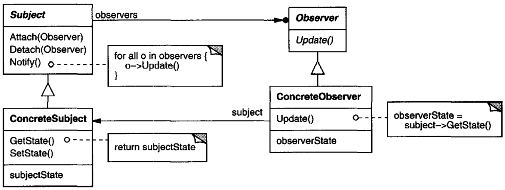

# 3-concurrent-producer-consumer

This repository is intended to show a typical producer-consumer-structure based on the `Observer` `Design Pattern`,
where `Subjects/Observees` act as `Producers` and the `Observers` as `Consumers`. 

*[UML diagram of the Observer pattern - taken from the famous `Design Patterns - Elements of Reusable Object-Oriented Software` book by GoF]*

Each `Consumer` has its own `BlockingQueue`, where `Producers` can put events in.

When a `BlockingQueue` is not full, `Producers` can put events in and continue.
If it is full, a  `Producer's` thread will wait until a free slot becomes available.

When a `Consumer's` `BlockingQueue` is not empty, `Consumers` take an event from the `BlockingQueue` and process it.
If it is empty, its `Consumer` will wait until something is put in the `BlockingQueue`.

Note that the waiting described above does not happen 'busily' but 'lazily'
and that we did not need any synchronized block to coordinate the `Producer` and `Consumer` threads.
This happens behind the scenes in the `BlockingQueue`.