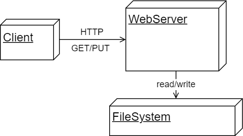

# 7-io-server

This repository is intended to demonstrate how a webserver can be setup with the Spring Boot framework
that performs basic input and output operations based on text files.
Clients do not directly get or put files but just text.
The server takes care of reading from and writing to text files.

